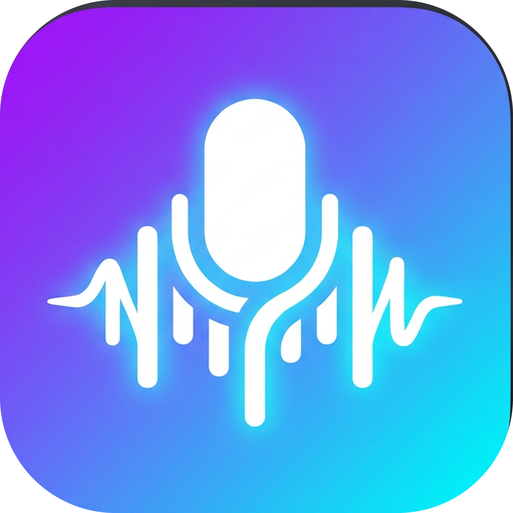

# VcApp

**Real-time voice changer + MP3 soundboard for Android.** Everything in the app UI is in English.

<p align="center">
  
</p>

## What it does

| Feature | Details |
|---|---|
| Volume in decibels | −20 dB … +20 dB output gain with a soft limiter |
| Pitch | −12 … +12 semitones (deep / male / female / chipmunk) |
| Bass & Treble | Low-shelf at 120 Hz and high-shelf at 4 kHz, −12 … +18 dB |
| Echo | Wet mix, delay 20–1500 ms, feedback |
| Reverb | Schroeder reverb, amount + room size |
| Distortion | Soft-clipping overdrive |
| Robot | Ring modulator (depth + frequency) |
| Tremolo | Depth + rate (alien / wobble) |
| Noise gate & low cut | Kill hiss and rumble |
| 14 built-in voices | Clean, Deep Voice, Chipmunk, Robot, Demon, Cave Echo, Bass Boost, Alien, Megaphone, Radio, Ghost, Girl, Man, Stadium |
| Custom presets | Save / load / delete your own |
| MP3 soundboard | Add MP3 / M4A / AAC / OGG / WAV / FLAC, per-clip volume, loop, "duck my voice" mode — clips are mixed into the same output as your voice |
| Recorder | Records the processed result to WAV and shares it to WhatsApp, Discord, Messenger, Telegram… |
| Floating bubble | Overlay controls (next preset, mute mic, fire clips, stop) on top of any call app |
| Foreground service | Keeps running while you are inside another app, with notification actions |
| Hear my own voice | Live tab toggle — silence your own monitoring, plus a quick 10-control Voice sound panel (Volume, Bass, Treble, Pitch, Echo, Reverb, Distortion, Robot, Tremolo, Noise gate) |
| Output routing | Speaker / Earpiece / Bluetooth SCO, plus system AEC + noise suppressor |

## How it works with WhatsApp / Discord / Messenger

1. **Live** tab → *Start voice changer* (grant microphone + notification permission).
2. Keep the output on **Speaker**.
3. Open WhatsApp / Discord / Messenger, start the call, turn the call's **loudspeaker on**.
4. Use the floating bubble to switch voices or fire MP3s without leaving the call.

**Important, honest note:** Android does not allow one app to replace the microphone
input of another app. WhatsApp, Discord and Messenger always read the real
microphone; only a rooted device (Magisk virtual-mic modules) or a PC with a
virtual audio cable can inject audio directly into their input. VcApp therefore
uses the two paths that work on a stock phone:

* **Loudspeaker path** — your processed voice and your MP3s are played out loud and
  picked up by the call microphone (this is what every voice changer on the Play
  Store does).
* **Recorder path** — record with effects and send the file as a voice message.

The whole explanation is also inside the app, in the **Guide** tab.

### Root: feed your changed voice straight into the call's microphone

On a **rooted** phone (Magisk + LSPosed) you can inject your processed voice directly
into the microphone of WhatsApp / Discord / Messenger instead of going through the
speaker. This is the only path on Android that truly replaces the mic for other apps,
and it needs **Zygisk-Next + JingMatrix LSPosed** to work on Android 15/16.

➡️ **Full step-by-step tutorial: [`ROOT_VOICE_INJECTION.md`](ROOT_VOICE_INJECTION.md)**

## Project layout

```
app/src/main/java/com/vcapp/voicechanger/
├── audio/
│   ├── Biquad.kt            low/high shelf + high-pass filters
│   ├── PitchShifter.kt      granular overlap-add pitch shifting
│   ├── Effects.kt           echo (delay line) and Schroeder reverb
│   ├── VoiceProcessor.kt    the full DSP chain
│   ├── VoiceSettings.kt     all knobs + the 14 built-in presets
│   ├── SoundboardMixer.kt   mixes decoded clips into the live stream
│   ├── AudioDecoder.kt      MediaCodec MP3/AAC/OGG → mono float PCM
│   └── VoiceEngine.kt       AudioRecord → DSP → AudioTrack, routing, WAV recorder
├── data/AppRepository.kt    SharedPreferences + Gson storage
├── service/
│   ├── EngineController.kt  shared state (StateFlow) for UI, service and bubble
│   ├── VoiceChangerService.kt  foreground service + notification actions
│   └── BubbleService.kt     draggable overlay bubble
└── ui/                      Jetpack Compose (Material 3) screens
    ├── MainActivity.kt, Theme.kt, Components.kt
    └── HomeScreen.kt, EffectsScreen.kt, PresetsScreen.kt, SoundboardScreen.kt, GuideScreen.kt
```

## Build

Requirements: JDK 17, Android SDK 34, Gradle 8.7 (wrapper included in the repo).

```bash
./gradlew assembleDebug        # APK at app/build/outputs/apk/debug/app-debug.apk
./gradlew installDebug         # install on a connected phone
```

* **Build on your phone (Termux, no root/Magisk):** see [`BUILD.md`](BUILD.md).
* **Prebuilt debug APK:** every push / pull request is built by the
  [`Build APK`](.github/workflows/build-apk.yml) workflow — grab the
  `VcApp-debug-apk` artifact from the latest green run in the Actions tab.

Minimum Android version: 7.0 (API 24). Target: Android 14 (API 34).

## Permissions used

`RECORD_AUDIO`, `MODIFY_AUDIO_SETTINGS`, `FOREGROUND_SERVICE` (+ microphone /
media-playback types), `POST_NOTIFICATIONS`, `SYSTEM_ALERT_WINDOW` (bubble, optional),
`BLUETOOTH_CONNECT` (SCO output, optional), `READ_MEDIA_AUDIO` (picking clips).

## Fair use

Made for fun and creativity. Do not use it to impersonate people, to harass anyone,
or to record calls where that is illegal where you live.
